# WeOPS-Framework


#### 更多资料/工具包下载可见“蓝鲸 S-mart市场”
https://bk.tencent.com/s-mart/application/282/detail

#### 更多问题欢迎添加“小嘉”微信，加入官方沟通群


# 嘉为蓝鲸WeOPS基础框架使用说明

## 开发使用

### 框架目录
```markdown
├── apps # 内置应用代码
├── apps_other # 自定义添加应用代码
├── base_index # 首页入口文件
├── blueapps # 蓝鲸内置应用
├── blueking # 蓝鲸API网关接口
├── config  # 配置文件
│    ├── template # 首页变量模板
│    ├── __init__.py # 基础配置文件
│    ├── default.py # 基础配置文件
│    ├── dev.py # 本地开发配置文件
│    ├── envs.json # 环境变量配置
│    ├── prod.py # 正式环境配置文件
│    ├── stag.py # 测试环境配置文件
├── locale # 语言包
├── packages # drf 配置
├── scripts # 脚本文件
│    ├── check_migrate # 校验提交模型字段
│    ├── check_commit_message.py # 校验提交信息是否包含规范的前缀
│    ├── check_requirements # 校验 requirements 是否符合要求
├── templates
├── utils # 内置工具包
├── .flake8 # flake8 效验规则配置
├── .gitignore
├── .isort.cfg # isort 规则
├── .pre-commit-config.yaml # pre-commit 配置
├── __init__.py
├── LICENSE
├── manage.py # 入口文件
├── pyproject.toml 
├── README.md
├── requirements.txt # 应用依赖包
├── runtime.txt # 应用运行python版本要求
├── settings.py # 应用基础配置文件
├── urls.py # 路由文件
├── wsgi.py # wsgi 配置启动
```


### 分支管理

- main

main 是主分支。

### 集成工具说明

#### pre-commit

pre-commit 是基于 Git Hooks 的本地开发套件，支持通过插件扩展能力。目前支持 PEP8 规范检查、代码格式化、commit 信息检查、
requirements.txt 包检查等功能。


### 功能开发

#### 环境安装

> 可使用pipenv,virtualenv,anaconda,此处仅演示anaconda

```shell
# 创建3.6虚拟环境
conda create --name auto-mate python=3.6
# 进入虚拟环境
conda activate venv
# 安装环境所需pip包
pip install -r requirements.txt -i https://mirrors.aliyun.com/pypi/simple/
#拉起本地环境
cd docker
docker-compose up
# 安装pre-commit
pip install pre-commit
pre-commit install --allow-missing-config
pre-commit install --hook-type commit-msg --allow-missing-config
```

#### 正式开发
1、在`apps_other`目录下新建python包，包名必须以`app_` 开头
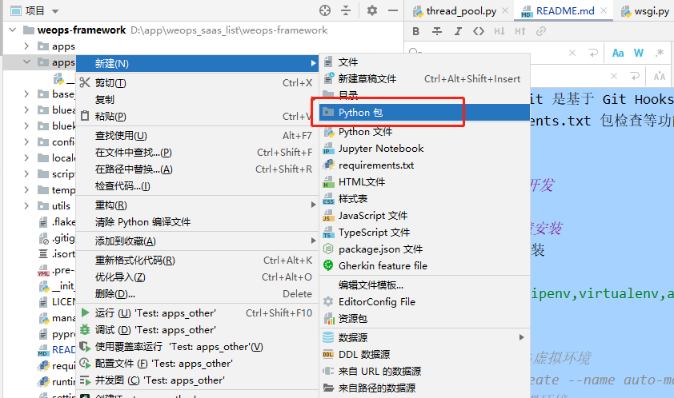

2、在对应包下新建`config.py`文件，需要包含以下内容：
```
app_name = "apps_other.app_yourApp" # 应用名称，与新建的python包名保持一致并添加前缀apps_other.即可
celery_tasks = ("apps_other.test.celery_tasks",) # celery后台任务文件路径，如果不需要，可以不需要这个变量
add_middleware = ("apps_other.test.middleware.TestMiddleware",) # app自定义中间件，不需要可以不要这个变量
# 这里可以将app需要的其它变量配置到这里，注意变量命名须以 APP_ 开头
```


3、模型
创建模型、迁移模型到库，并将模型注册到admin模块
在`apps_other/yourApp/`目录下新建`models.py`文件，进行模型创建。创建完模型之后，在Terminal交互界面进行数据迁移。
```shell
# 数据迁移
py .\manage.py makemigrations
py .\manage.py migrate
```
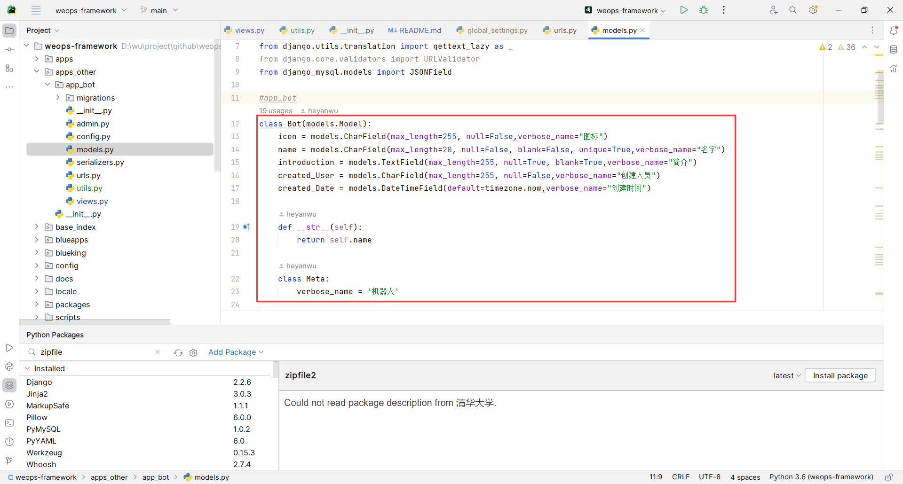

在`apps_other/yourApp/`目录下新建`admin.py`文件，将模型注册到admin模块，方便admin管理模型。
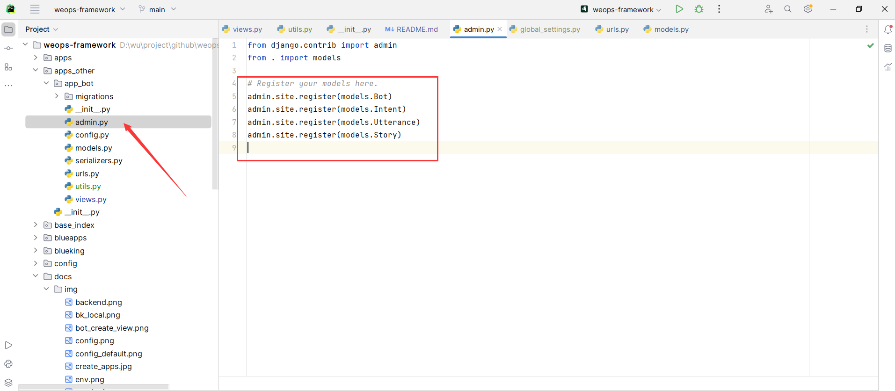

4、视图
“创建视图”
在`apps_other/yourApp/`目录下新建`views.py`文件，进行接口开发。
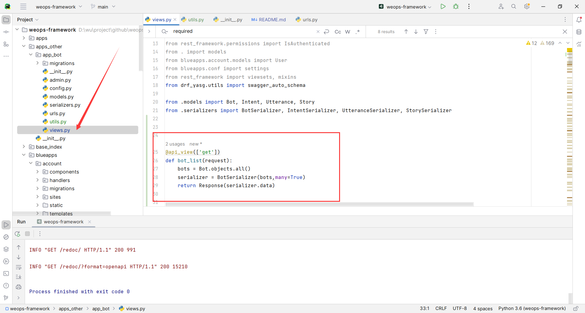

5、路由
“注册路由”
在`apps_other/yourApp/`目录下新建`urls.py`文件，添加`app_name`及`urlpatterns`，修改视图注册app及路由地址。
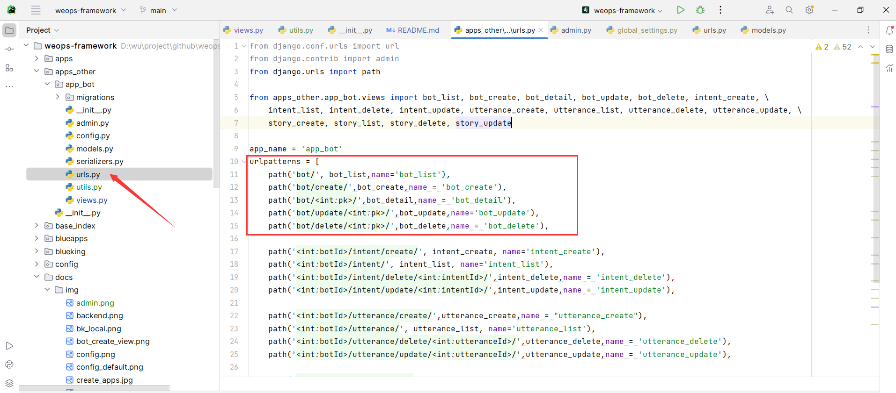

6、环境变量配置
如果开发过程中需要使用到环境变量，可以按照如下，选择一个.env文件添加
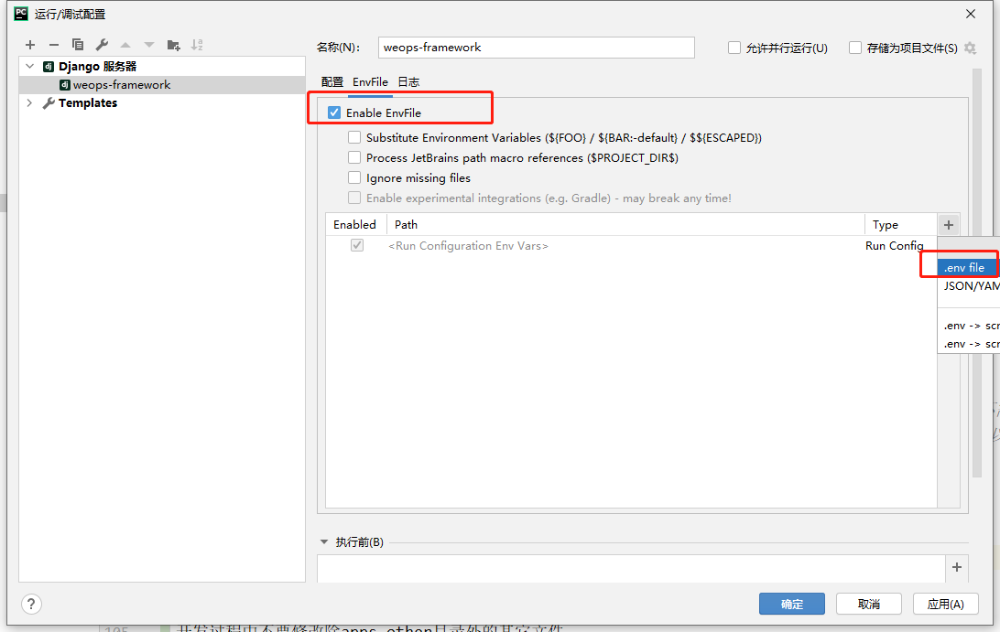
文件内容格式如下：
```
APP_ID=WEOPS
APP_TOKEN=123456
```


7、注意事项
开发过程中不要修改除apps_other目录外的其它文件
本地开发时，可以在根目录新建local_settings.py文件，并将database相关的配置信息写在里面
```
DATABASES = {
    "default": {
        "ENGINE": "django.db.backends.mysql",
        "NAME": "",  # noqa
        "USER": "",
        "PASSWORD": "",
        "HOST": "",
        "PORT": "",
        # 单元测试 DB 配置，建议不改动
        "TEST": {"NAME": "test_db", "CHARSET": "utf8", "COLLATION": "utf8_general_ci"},
    },
}
```


#### 登录功能

##### 登录方式

登录方式分为基于蓝鲸平台认证登录、基于本地mysql数据库用户验证登录、其他登录方式
基于蓝鲸平台认证登录时，开发环境为blueking
基于本地mysql认证登录时，开发环境为local
基于keycloak认证登录时，开发环境为keycloak
需进行不同平台认证开发时，将环境变量调换即可
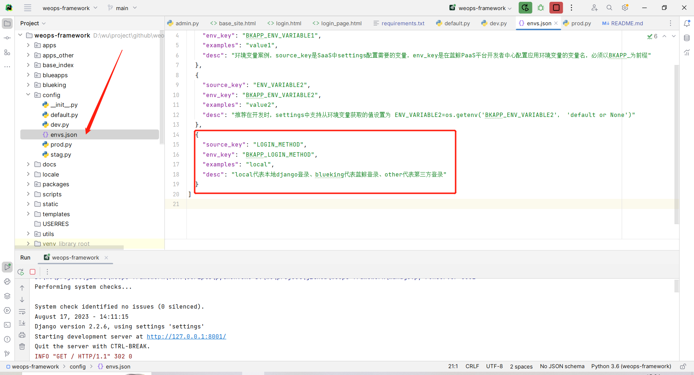

##### 第三方登录接入 以（mysql登录验证为例）
1、新建用户登录需求包
在`blueapps/account/`目录下新建python包,在对应包下新建`backends.py`,`middlewares.py`,`models.py`文件
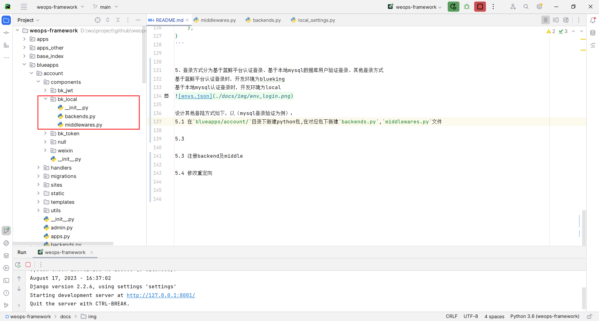

2、新建用户模型
在`models.py`中新建user模型
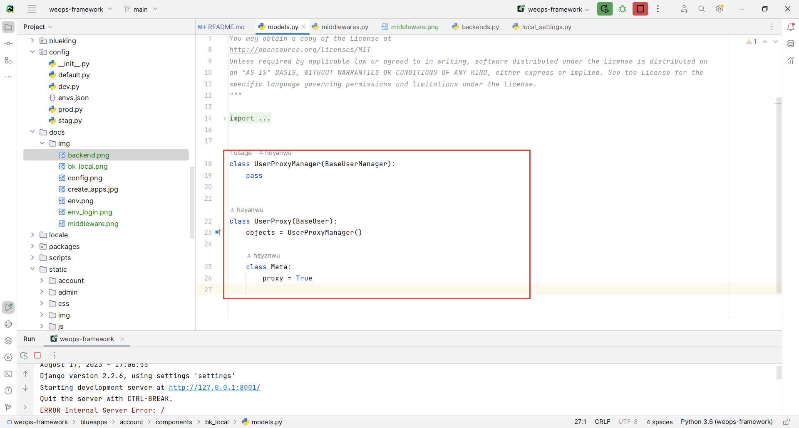

3、新建用户登录中间件
在`middlewares.py`中新建中间件`LocalLoginRequiredMiddleware`,此处填写用户登录提交方法
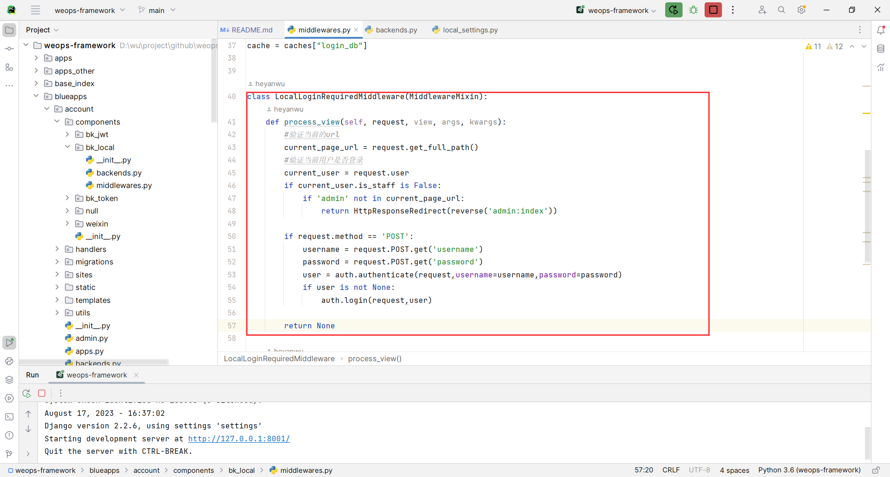

4、新建用户登录验证
在`backends.py`中新建`LoginBackend`，此处填写用户登录验证方法
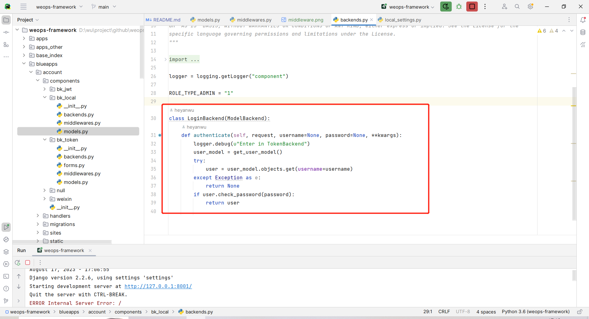

5、将配置文件进行注册
在`blueapps/account/sites/open`目录下的`conf.py`文件中注册`backend`及`middleware`
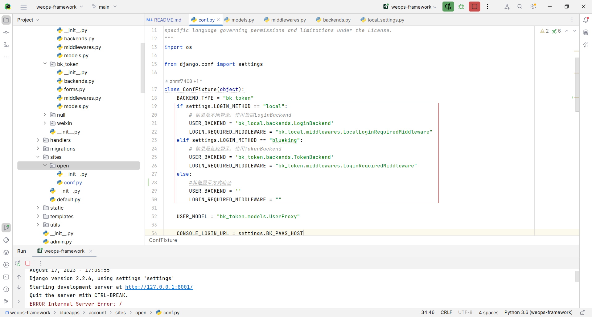

6、注释环境变量
通过判断不同的环境变量，用户进行不同方式的登录,在目录`config/`中修改`envs.json`,从而注释多种环境变量


7、配置环境变量及修改重定向
在目录`config/`中修改`default.py`文件中的缓存，配置环境变量，及修改用户登录的重定向（Django自带用户登录窗口，开发时可根据需要，是否修改重定向）
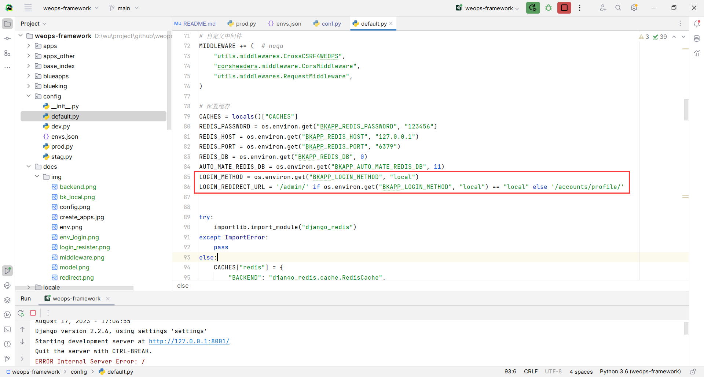

### 注意事项
使用keycloak作为开发时，需要打开direct直连以及修改token认证时间
在浏览器地址栏输入keycloak的客户端地址  localhost:8080


账号：admin，密码：admin，通过UI界面进入到keycloak的客户端，然后更改直连、token过期时间、IP访问限制

直连的作用为在pycharm开发时，可以通过接口进行keycloak的访问
这支持直接访问授权，这意味着客户端可以访问用户的用户名/密码，并直接与 Keycloak 服务器交换访问令牌。根据 OAuth2 规范，这可以支持该客户端的“资源所有者密码凭证授予”。
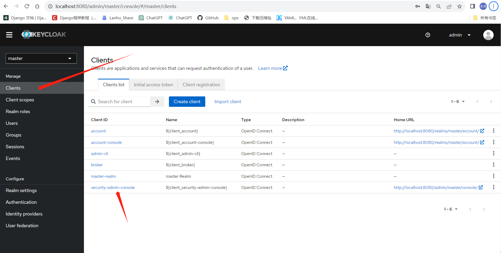
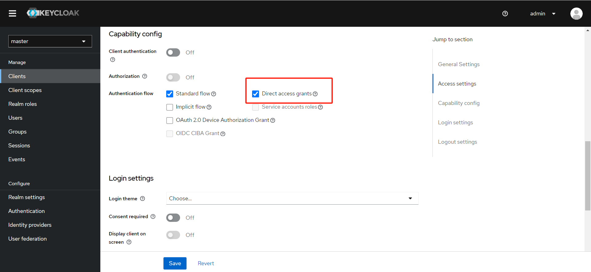

调整token 的过期时间


#### swagger文档

1.如何写swagger文档
在 `urls.py` 配置 `Swagger` 视图：在根目录的 `urls.py` 文件中，导入 `schema_view` 并将其添加到 `URL` 配置中：
备注：根据项目信息来填充 title、description、terms_of_service、contact 和 license 等字段（可不更改）
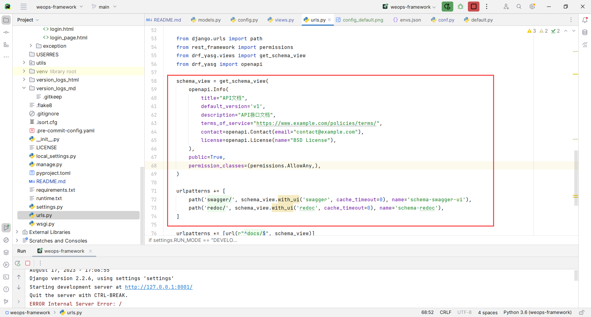

在`apps_other/yourApp/`目录下的`views.py`文件中，进行接口开发时，使用 @swagger_auto_schema 装饰器来自定义每个操作的参数、请求和响应
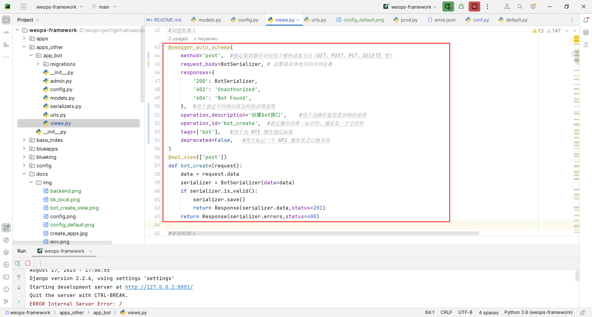
2.文档地址
API展示地址：http://127.0.0.1:8000/redoc/
API测试地址：http://127.0.0.1:8000/swagger/
两者之间的主要区别在于界面风格和功能。如果希望交互式地测试 API，查看请求和响应数据，那么可以使用 Swagger UI。如果更关注文档的视觉效果和展示，可以选择使用 ReDoc

注意：默认只有本地开发时启动swagger

#### 开发app自动注入
1、开发app完成之后，将该应用注入到系统管理中，进行权限管理。注入方式为根据配置文件进行自动注入
在该app下创建一个新的文件  `inst_permission_conf.py`，用以配置应用中需要管理的模型以及序列化器等参数，样例如下：
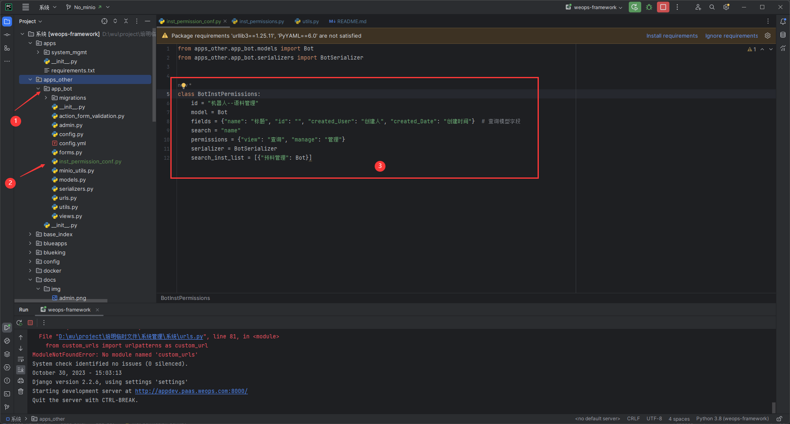
2、自动初始化casbin-mesh
在程序运行时，如果旧的casbin-mesh容器被关闭，新的casbin-mesh容器被打开，这时容器中不存在旧casbin-mesh的数据，因此需要将数据进行同步
在上图中，参数 'search_inst_list'为设置初始化所必须的参数

#### 注意
1、测试Swagger接口时，无数据输入界面：
调整根目录下`urls.py`文件，修改`schema_view = get_schema_view`,确保get_schema_view引用正确，同时检查`drf_yasg`版本
在`apps_other/yourApp`目录下设计views时，检查接口方法

2、from django.shortcuts import render_to_response   ImportError: cannot import name 'render_to_response'
在 Django 2.0 版本及之后，render_to_response 函数已经被弃用，并且在 Django 3.0 版本中已移除。取而代之的是使用 render 函数。如果你正在使用 Django 2.0 或更高版本，应该使用 render 函数来渲染视图。

3、在管理员登陆界面进行登录之后，跳转到`127.0.0.1:8001/admin/accounts/profile`,而不是管理员管理界面
django自带管理员登录界面，在实际开发中，如有需要重新进行设计，可遇到此问题，原因在于django默认一个跳转路线，在开发时，可根据5.7，重新设计重定向
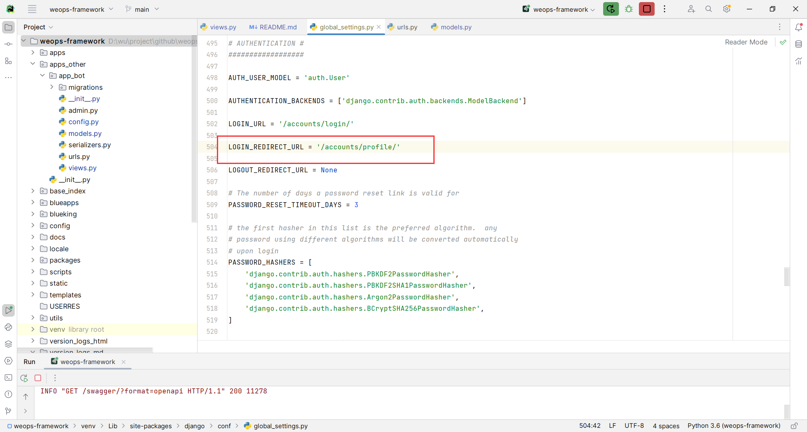
